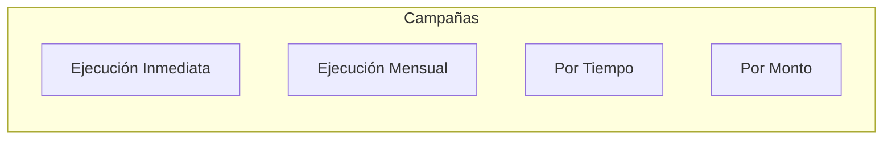
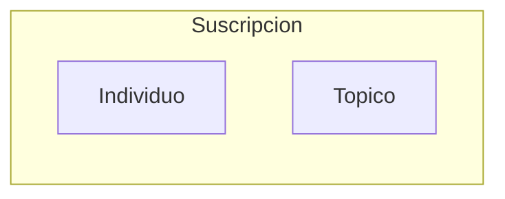

[![GPL LICENSE][license-shield]][license-url]
[![Contributors][contributors-shield]][contributors-url]
[![Issues][issues-shield]][issues-url]

# Give
## Índice

- [Acerca del proyecto](#acerca-del-proyecto)
    - [Campañas](#Campañas)
    - [Suscripciones](#Suscripciones)
- [Documentación](#documentación)
  - [Casos de Uso](#casos-de-uso)
  - [Máquinas de estados](#máquinas-de-estados)
  - [Documentación complementaria](#documentación-complementaria)

## Acerca del proyecto
La creación de esta plataforma de donación fue motivada por la falta de una aplicación que permita a **las personas hacer donaciones de manera fácil y segura, y asegurarse de que el dinero llegue al destino deseado**. La falta de transparencia y seguridad en los procesos de donación tradicionales a menudo hace que las personas se sientan incómodas al hacer donaciones y puede disuadir a muchas de hacer contribuciones importantes a las causas que les importan. Esta plataforma de donación tiene como objetivo abordar estas preocupaciones al ofrecer una experiencia de donación transparente y segura para todos los usuarios.
### Campañas
1. **Campañas de Ejecución Inmediata:** Estas campañas se enfocan en casos especiales de crowdfunding que abordan asuntos críticos y requieren una resolución rápida. Son supervisadas por moderadores para garantizar la transparencia y la efectividad de las donaciones.

2. **Crowdfunding Por Tiempo:** En esta modalidad, se recauda la mayor cantidad de dinero en un tiempo determinado. Una vez que el período concluye, los fondos se transfieren a la persona o causa designada.

3. **Crowdfunding Por Monto:** En esta variante, se establece un plazo específico para recaudar una cantidad determinada de dinero. Si no se alcanza la meta, el monto se devuelve a los donantes; en caso de superarla, el excedente se destina a la persona o entidad beneficiaria.

4. **Campaña de Ejecución Mensual:** Esta modalidad permite a los usuarios configurar donaciones mensuales a una causa o persona específica. Los usuarios pueden apoyar de manera sostenible a individuos o temas que les importen a lo largo del tiempo.

En adición a la donación en forma de dinero, **será posible que las campañas requieren de donaciones de otro tipo, como por ejemplo, horas hombre de determinado tipo de rubro como: carpintería, plomería, electricidad, etc**. Además de donaciones de comida, maquinaria, ropa o otros bienes que puedan ser útiles para la campaña. Esto permitirá a los usuarios donar de diversas formas, no solo monetariamente, y brindará a las campañas una mayor oportunidad de éxito al contar con recursos valiosos.

### Suscripciones:
- **Suscripciones a Individuos**: Los usuarios también tienen la opción de suscribirse aportando un monto mensual a un usuario particular. Pueden elegir el monto que desean donar regularmente.

- **Suscripciones a Tópicos**: Los usuarios pueden suscribirse aportando un monto específico a una categoría o tópico especial. El dinero se distribuirá entre los principales exponentes de ese campo.

El sistema valora a las empresas por sus proyectos exitosos y la opinión de la comunidad. También valora los proyectos en función de la urgencia, especialmente en el caso de proyectos médicos. Finalmente, permite a los usuarios tomar decisiones informadas al mostrar las elecciones previas de la comunidad y la cantidad de veces que una categoría fue seleccionada.

**Es importante destacar que esta plataforma tiene como objetivo hacer que el proceso de donación sea lo más accesible y fácil posible para todos los usuarios**. Es por eso que se van a soportar todos los medios de pagos existentes, incluyendo tarjetas de crédito, transferencias bancarias, y billeteras virtuales. De esta manera, los usuarios pueden elegir el método de pago que más les convenga y hacer su donación de forma segura y confiable. Con esta amplia gama de opciones de pago, la plataforma asegura que nadie se queda atrás en la contribución a causas importantes.

## Documentación

### Casos de Uso
- [casos-de-uso-resumen.md](documentation/casos-de-uso-resumen.md): Resumen de Casos de Uso.
- [CU-Inicio-Sesión.md](documentation/CU-Inicio-Sesión.md): Caso de uso - Inicio de Sesión.
- [CU-Recupero-Contraseña.md](documentation/CU-Recupero-Contraseña.md): Caso de uso - Recuperación de Contraseña.
- [CU-Validación-Persona.md](documentation/CU-Validación-Persona.md): Caso de uso - Validación de Persona.
- [CU-crear-campaña.md](documentation/CU-crear-campaña.md): Caso de uso - Crear Campaña.
- [CU-crear-usuario.md](documentation/CU-crear-usuario.md): Caso de uso - Crear Usuario.
- [CU-donar-a-campaña.md](documentation/CU-donar-a-campaña.md): Caso de uso - Donar a Campaña.
- [CU-donar-a-suscripcion.md](documentation/CU-donar-a-suscripcion.md): Caso de uso - Donar a Suscripción.
- [CU-editar-campaña.md](documentation/CU-editar-campaña.md): Caso de uso - Editar Campaña.
- [CU-informar-avance-campaña.md](documentation/CU-informar-avance-campaña.md): Caso de uso - Informar Avance de Campaña.
- [CU-pagos-automaticos.md](documentation/CU-pagos-automaticos.md): Caso de uso - Pagos Automáticos.
- [CU-pausar-campaña.md](documentation/CU-pausar-campaña.md): Caso de uso - Pausar Campaña.

### Maquinas de estados
- [maquina-de-estados-campaña.md](documentation/maquina-de-estados-campaña.md): Máquina de Estados - Campaña.

### Documentación complementaria
- [glosario.md](documentation/glosario.md): Glosario de Términos.
- [reglas-de-negocio.md](documentation/reglas-de-negocio.md): Reglas de Negocio.
- [riesgos.md](documentation/riesgos.md): Identificación de Riesgos.

[license-shield]: https://img.shields.io/github/license/francoo27/give.svg?style=for-the-badge
[license-url]: https://github.com/francoo27/give/blob/main/LICENSE
[contributors-shield]: https://img.shields.io/github/contributors/francoo27/give.svg?style=for-the-badge
[contributors-url]: https://github.com/francoo27/give/graphs/contributors
[issues-shield]: https://img.shields.io/github/issues/francoo27/give.svg?style=for-the-badge
[issues-url]: https://github.com/francoo27/give/issues
