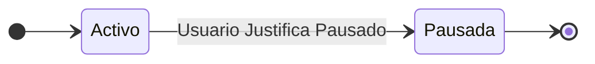
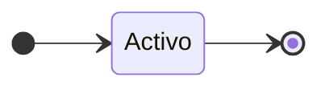

**Código y Nombre del CASO  DE  USO:** Pausar Campaña

| Nivel  | Estructura | Alcance|Caja|Instanciacion| Interaccion|
|:------- |:-------|:-----|:-----|:-----|:-----|
| Resumen    | Estructurado | Sistema |Negra |Real |Semantico|

**Meta del CASO  DE  USO:** Pausar una campaña activa.

**ACTORES**

**Primario:** Usuario registrado.

**Iniciador:** Usuario registrado.

**Otros:** Moderador (para casos especiales).

**PRECONDICIONES (de negocio):**
- El usuario debe estar registrado en la plataforma.
- Tiene una campaña activa.

**PRECONDICIONES (de negocio):** --

**PRECONDICIONES (de sistema):** --

**DISPARADOR:** --

**FLUJO DE SUCESOS**

**CAMINO BÁSICO:**
1. El usuario selecciona la opción "Gestionar Campañas".
2. El sistema muestra una lista de campañas activas.
3. El usuario selecciona la campaña que desea pausar temporalmente.
4. El sistema muestra opciones de gestión para la campaña seleccionada.
5. El usuario elige la opción "Pausar Campaña".
6. El sistema solicita una razón para pausar la campaña.
7. El usuario proporciona una razón válida y temporal para la pausa.
8. El sistema pausa la campaña y registra la razón proporcionada.
9. El sistema notifica al usuario que la campaña se ha pausado con éxito y proporciona un número de referencia.

**CAMINOS ALTERNATIVOS:**

**POSTCONDICIONES (de sistema):**

**Éxito:** La campaña seleccionada se pausa temporalmente en el sistema, y se registra la razón proporcionada para la pausa.

**Fracaso:** Si el usuario no puede proporcionar una razón válida , el caso de uso se cancela y la campaña no se pausa.

**Informacion**
1. **Necesidad de Reevaluación de Objetivos**: Si los objetivos de financiamiento no se están alcanzando y es necesario reevaluar la cantidad requerida o los hitos establecidos.

2. **Cambios en la Estrategia de Recompensas**: Si es necesario ajustar las recompensas ofrecidas a los patrocinadores o revisar los niveles de contribución.

3. **Revisión de Contenido de la Campaña**: Si es necesario revisar y mejorar la descripción, el video o las imágenes utilizadas en la página de la campaña.

4. **Problemas Legales o Regulatorios**: Si surgen problemas legales o regulatorios que requieren la revisión y posiblemente la pausa de la campaña.

5. **Progreso Insuficiente**: Si el progreso de la campaña es insuficiente y se necesita tiempo adicional para generar interés y contribuciones.

6. **Cambio en el Producto/Servicio Ofrecido**: Si se realizan cambios en el producto o servicio que se está financiando y se necesita tiempo para comunicar estos cambios a los patrocinadores.

7. **Necesidad de Negociar Acuerdos con Socios**: Si se requiere tiempo para negociar acuerdos con socios o inversores externos que puedan respaldar la campaña.

8. **Problemas de Entrega de Recompensas**: Si existen problemas logísticos o de entrega de las recompensas prometidas a los patrocinadores y se necesita tiempo para resolverlos.

9. **Revisión de Datos y Análisis**: Si se necesita tiempo para recopilar y analizar datos sobre el rendimiento de la campaña y tomar decisiones informadas.

10. **Cambios en la Estrategia de Financiamiento**: Si es necesario explorar nuevas estrategias de financiamiento o buscar inversiones externas.

11. **Pausa Planificada**: Si se había planeado previamente pausar la campaña en un momento específico como parte de la estrategia de financiamiento.

12. **Otro**: El usuario provee una descripcion que no cuadre dentro de la lista previa.

13. **MODERACION**: Moderador pausa.
