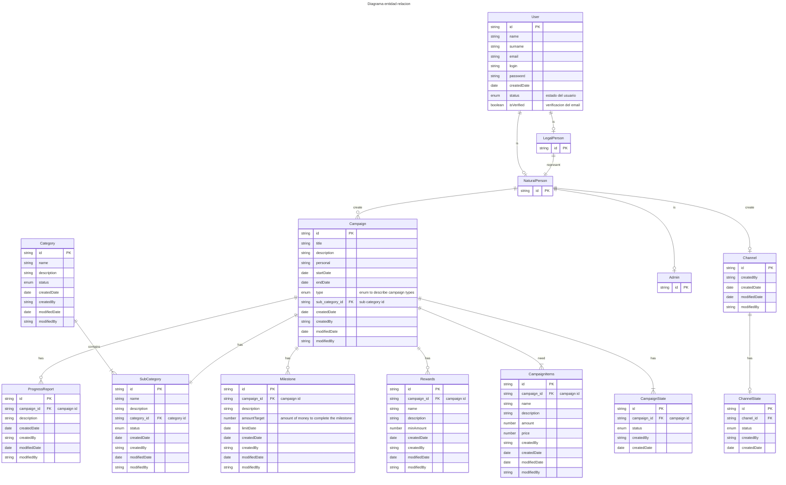

---

### Estados (baja logica)

Para evitar usar **borrado en cascada** en entidades criticas como usuario, camapaña, etc. Vamos a utilizar un estado interno para identificar esta situación.

- Activo

- Inactivo
    

### Auditoria

Para mantener **trazabilidad** de los cambios en las distintas entidades vamos a registrar los siguientes datos:

- Fecha de creación

- Creado por

- Fecha de modificación

- Modificado por