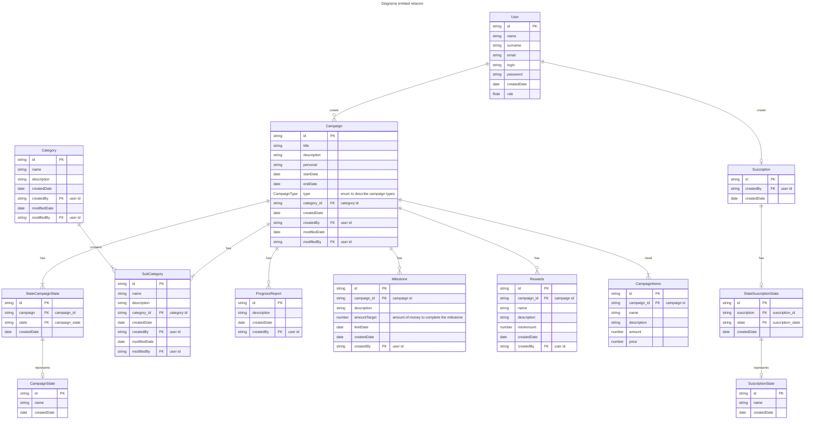

```mermaid
---
title: Diagrama entidad relacion
---
erDiagram
    User ||--o{ Campaign : create
    User {
        string id PK
        string name
        string surname
        string email
        string login
        string password
        date createdDate
        Role role
    }
    User ||--o| Suscription : create
    Suscription {
        string id PK
        string createdBy FK "user id"
        date createdDate
    }
    Suscription ||--o| StateSuscriptionState : has
    StateSuscriptionState {
        string id PK
        string suscription FK "suscription_id"
        string state FK "suscription_state"
        date createdDate
    }
    StateSuscriptionState ||--o| SuscriptionState : represents
    SuscriptionState {
        string id PK
        string name
        date createdDate
    }      
    Category ||--|{ SubCategory : contains 
    Category {
        string id PK
        string name
        string description
        date createdDate 
        string createdBy FK "user id"
        date modifiedDate
        string modifiedBy FK "user id"
    }
    SubCategory {
        string id PK
        string name
        string description
        string category_id FK "category id"
        date createdDate 
        string createdBy FK "user id"
        date modifiedDate
        string modifiedBy FK "user id"
    }
    Campaign ||--o{ ProgressReport : has
    Campaign ||--|{ SubCategory : has
    Campaign ||--o{ Milestone : has
    Campaign ||--o{ Rewards : has
    Campaign ||--|{ CampaignItems : need
    Campaign ||--|{ StateCampaignState : has
    Campaign {
        string id PK
        string title
        string description
        string personal
        date startDate
        date endDate
        CampaignType type "enum to describe campaign types"
        string category_id FK "category id"
        date createdDate 
        string createdBy FK "user id"
        date modifiedDate
        string modifiedBy FK "user id"
    }
    StateCampaignState {
        string id PK
        string campaign FK "campaign_id"
        string state FK "campaign_state"
        date createdDate
    }
    StateCampaignState ||--o| CampaignState : represents
    CampaignState {
        string id PK
        string name
        date createdDate
    }  

    CampaignItems {
        string id PK
        string campaign_id FK "campaign id"
        string name
        string description
        number amount
        number price
    }
    ProgressReport {
        string id PK
        string description
        date createdDate 
        string createdBy FK "user id"
    }
    Milestone {
        string id PK
        string campaign_id FK "campaign id"
        string description
        number amountTarget "amount of money to complete the milestone"
        date limitDate
        date createdDate 
        string createdBy FK "user id"
    }
    Rewards {
        string id PK
        string campaign_id FK "campaign id"
        string name
        string description
        number minAmount
        date createdDate 
        string createdBy FK "user id"
    }

```