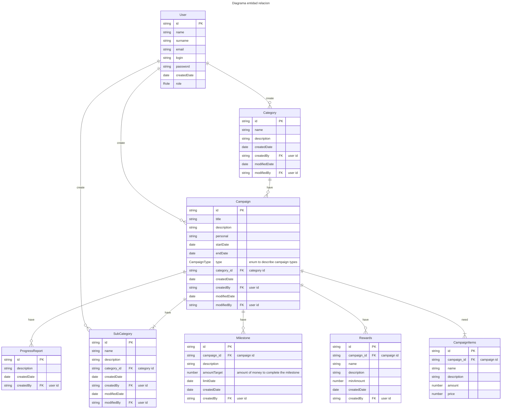

```mermaid
---
title: Diagrama entidad relacion
---
erDiagram
    User ||--o{ Category : create
    User ||--o{ SubCategory : create
    User ||--o{ Campaign : create
    User {
        string id PK
        string name
        string surname
        string email
        string login
        string password
        date createdDate
        Role role
    }  
    Category ||--o{ Campaign : have 
    Category {
        string id PK
        string name
        string description
        date createdDate 
        string createdBy FK "user id"
        date modifiedDate
        string modifiedBy FK "user id"
    }
    SubCategory {
        string id PK
        string name
        string description
        string category_id FK "category id"
        date createdDate 
        string createdBy FK "user id"
        date modifiedDate
        string modifiedBy FK "user id"
    }
    Campaign ||--o{ ProgressReport : have
    Campaign ||--|{ SubCategory : have
    Campaign ||--o{ Milestone : have
    Campaign ||--o{ Rewards : have
    Campaign ||--|{ CampaignItems : need
    Campaign {
        string id PK
        string title
        string description
        string personal
        date startDate
        date endDate
        CampaignType type "enum to describe campaign types"
        string category_id FK "category id"
        date createdDate 
        string createdBy FK "user id"
        date modifiedDate
        string modifiedBy FK "user id"
    }
    CampaignItems {
        string id PK
        string campaign_id FK "campaign id"
        string name
        string description
        number amount
        number price
    }
    ProgressReport {
        string id PK
        string description
        date createdDate 
        string createdBy FK "user id"
    }
    Milestone {
        string id PK
        string campaign_id FK "campaign id"
        string description
        number amountTarget "amount of money to complete the milestone"
        date limitDate
        date createdDate 
        string createdBy FK "user id"
    }
    Rewards {
        string id PK
        string campaign_id FK "campaign id"
        string name
        string description
        number minAmount
        date createdDate 
        string createdBy FK "user id"
    }

```