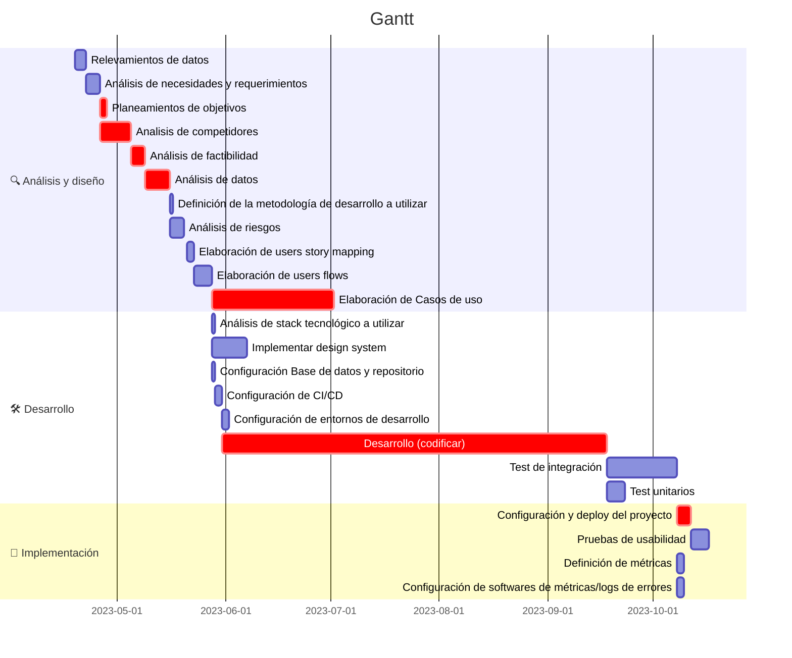

## Tabla resumen de tareas a realizar

| Id  | Nombre de la tarea | Duracion (días) | Comienzo | Fin | Predecesoras |
| :-: | :----------------- | :-------------: | :------: | :-: | :----------: |
|**🔵**| **🔍 Análisis y diseño** | **101** | **19/04/2023** | **29/07/2023** | **-** |
| 2   | Relevamientos de datos | 3 | 19/04/2023 | 22/04/2023 | - |
| 3   | Análisis de necesidades y requerimientos | 4 | 22/04/2023 | 26/04/2023 | 2 |
| 4   | Planeamientos de objetivos | 2 | 26/04/2023 | 28/04/2023 | 3 |
| 5   | Analisis de competidores | 9 | 28/04/2023 | 05/05/2023 | 3 |
| 6   | Análisis de factibilidad | 4 | 05/05/2023 | 09/05/2023 | 4 - 5 |
| 7   | Análisis de datos | 7 | 09/05/2023 | 16/05/2023 | 6 |
| 8   | Definición de la metodología de desarrollo a utilizar | 1 | 16/05/2023 | 17/05/2023 | 7 |
| 9   | Análisis de riesgos | 4 | 17/05/2023 | 21/05/2023 | 7 |
| 10  | Elaboración de users story mapping | 2 | 21/05/2023 | 23/05/2023 | 8 - 9 |
| 11  | Elaboración de users flows | 5 | 23/05/2023 | 28/05/2023 | 10 |
| 12  | Elaboración de Casos de uso | 35 | 28/05/2023 | **29/07/2023** | 11 |
|**🔴**| **🛠 Desarrollo** | **138** | **23/05/2023** | **08/10/2023** | **-** |
| 14  | Análisis de stack tecnológico a utilizar | 1 | 28/05/2023 | 29/05/2023 | 10 |
| 15  | Implementar design system | 10 | 28/05/2023  | 07/06/2023 | 10 |
| 16  | Configuración Base de datos y repositorio | 1 | 29/05/2023 | 30/05/2023 | 14 |
| 17  | Configuración de CI/CD | 2 | 29/05/2023 | 31/05/2023 | 14 |
| 18  | Configuración de entornos de desarrollo | 2 | 31/05/2023 | 02/06/2023 | 17 |
| 19  | Desarrollo (codificar) | 110 | 31/05/2023 | 18/09/2023 | 18 |
| 20  | Test unitarios | 5 | 18/09/2023 | 23/09/2023 | 19 |
| 21  | Test de integración | 20 | 18/09/2023 | **08/10/2023** | 19 |
|**🟢**| **🚀 Implementación** | **9** | **08/10/2023** | **17/10/2023** | **-** |
| 23  | Configuración y deploy del proyecto | 4 | 08/10/2023 | 12/10/2023 | 21 |
| 24  | Pruebas de usabilidad | 5 | 12/10/2023 | **17/10/2023** | 23 |
| 25  | Definición de métricas | 2 | 08/10/2023 | 10/10/2023 | 21 |
| 26  | Configuración de softwares de métricas/logs de errores | 2 | 08/10/2023 | 10/10/2023 | 21 |

**Duración total del proyecto:** 138 dias

**Fecha fin (estimada):** 17/10/2023

[Volver a README](../README.md)