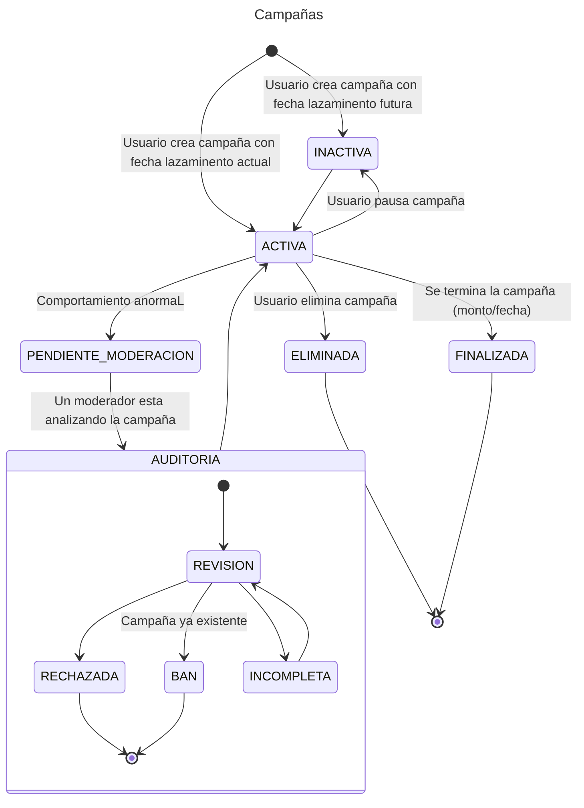

```mermaid
---
title: Campañas
---

stateDiagram-v2

    [*] --> INACTIVA: Usuario crea campaña con fecha lazaminento futura
    [*] --> ACTIVA: Usuario crea campaña con fecha lazaminento actual

    INACTIVA --> ACTIVA
    ACTIVA --> INACTIVA: Usuario pausa campaña

    PENDIENTE_MODERACION --> AUDITORIA : Un moderador esta analizando la campaña

    state AUDITORIA {
        [*] --> REVISION
        REVISION --> RECHAZADA
        REVISION --> BAN: Campaña ya existente
        REVISION --> INCOMPLETA
        INCOMPLETA --> REVISION
        RECHAZADA --> [*]
        BAN --> [*]
    }


    AUDITORIA --> ACTIVA

    ACTIVA --> PENDIENTE_MODERACION: Comportamiento anormaL

    ACTIVA --> ELIMINADA: Usuario elimina campaña

    ACTIVA --> FINALIZADA: Se termina la campaña (monto/fecha)

    ELIMINADA --> [*]
    FINALIZADA --> [*]
```
